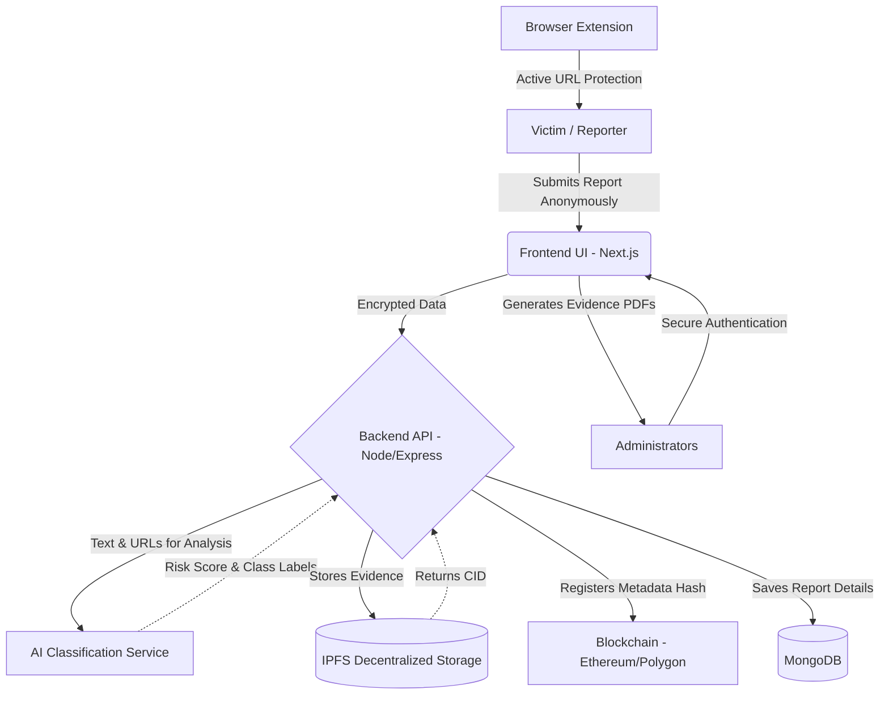

# POCSO SafeGuard & Security Command Center

> A secure, anonymous, tamper-proof reporting platform using Blockchain and AI.


---

## 📋 Overview

The **Blockchain-Based POCSO (Protection of Children from Sexual Offences) Reporting System** is a sophisticated, multi-layered architecture designed to securely, anonymously, and immutably record critical incidents. It leverages Artificial Intelligence for real-time threat analysis and Blockchain technology to ensure tamper-evident evidence storage, aiming to create a highly secure environment for reporting and mitigating threats.

---

## 🏗️ Architecture & Data Flow



### Flow Breakdown:
1. **Reporting:** Users submit textual reports and evidence anonymously via the modern web interface.
2. **Anonymization:** The Node.js backend automatically hashes the user's IP addressing (`crypto`) to preserve absolute anonymity.
3. **AI Analysis:** The report contents are forwarded to the Python-based AI service. A zero-shot NLP model processes the text, extracts URLs, and flags malicious categories (grooming, threat, sexual content) calculating a final severity score.
4. **Data Persistence & Integrity:** 
   - Evidence files are uploaded to the **IPFS** network, returning a unique Content Identifier (CID).
   - The CID alongside a cryptographic hash of the report data is logged onto a **Smart Contract**, rendering the record immutable and cryptographically verifiable in a court of law.
   - Non-sensitive operational metadata is stored in **MongoDB** for responsive dashboard queries.
5. **Command Center:** Authorized personnel access an administrative dashboard via secure, HttpOnly cookie sessions to review flagged cases, visualize metrics, and export professional PDF dossiers.

---

## 💻 Tech Stack

### 1. Frontend (Security Command Center)
- **Framework:** Next.js & React
- **Styling & Animation:** Tailwind CSS, Framer Motion
- **State Management:** Zustand
- **Data Visualization & Icons:** Recharts, Lucide React
- **Utilities:** jsPDF & html2canvas (for native PDF generation)

### 2. Backend (Core API)
- **Framework:** Node.js with Express.js
- **Database:** MongoDB (via Mongoose)
- **Blockchain Integration:** Ethers.js
- **Decentralized Storage:** IPFS integration
- **Security:** Crypto (IP anonymization), JWT (HttpOnly cookie authentication), CORS security policies, Multer.

### 3. AI Service (NLP & Threat Detection)
- **Framework:** Python, FastAPI, Uvicorn
- **Machine Learning:** HuggingFace Transformers, PyTorch
- **Models:** `facebook/bart-large-mnli` (Zero-Shot Classification)
- **Capabilities:** URL Extraction, Confidence/Risk Scoring, Automated Text Cleaning.

### 4. Browser Extension (POCSO SafeGuard)
- **Platform:** Chrome Extension (Manifest V3 API)
- **Features:** Declarative Net Request for robust blocking, background service workers, local blocklists, honey-pot tracking, and active warning injections.

---

## 🚀 Getting Started

### Prerequisites
- Node.js (v18+)
- Python (v3.9+)
- MongoDB Instance (Local or Atlas)
- IPFS Node or Gateway API Keys
- Blockchain Provider Node (e.g., Infura, Alchemy)

### Installation

1. **Clone the repository**
```bash
git clone <repository-url>
cd craftathon
```

2. **Start the Frontend**
```bash
cd frontend
npm install
npm run dev
```

3. **Start the Backend**
```bash
cd backend
npm install
# Ensure you configure your .env file with appropriate keys
npm run dev
```

4. **Start the AI Service**
```bash
cd ai_service
pip install -r requirements.txt
uvicorn api:app --reload
```

5. **Install the Browser Extension**
- Open Chrome browser, navigate to `chrome://extensions/`
- Enable **"Developer mode"** in the top right.
- Click **"Load unpacked"** and select the `Extension` directory within the project folder.

---

## 👥 Contributors & Deliverables

- **Vishmayraj**
  - Implemented `content_classifier` (grooming / sexual / threat classification).
  - Developed `severity` scoring pipeline (Possibly Prank / Low / Medium / High / Highest).
  - Built `url_extractor` to seamlessly parse and extract URLs from unformatted text inputs.
  - Deployed the `inference_api` for real-time classification endpoints.
  - *Future Scope:* Implementation of targeted `detection_of_flagged_domains` against known harmful domains.

- **Varun kushwaha**
  - Designed and implemented the decentralized evidence storage pipeline using **IPFS (Pinata)** for secure and distributed data storage.
  - Integrated Blockchain (Ethereum Sepolia) to store:
        - **Evidence hashes (IPFS CID)**
        - **Report metadata (JSON)**
  - Built the end-to-end pipeline for report handling:
→ Evidence upload → IPFS storage → Hash generation → Blockchain logging

- **[Add Contributor Name]**
  - [Deliverable 1]
  - [Deliverable 2]
